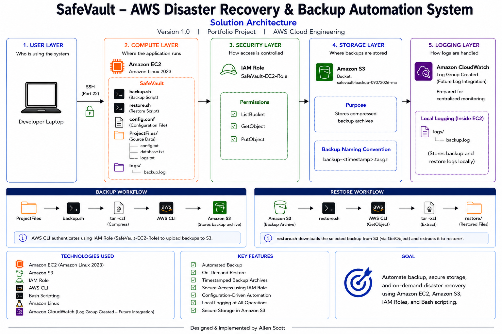
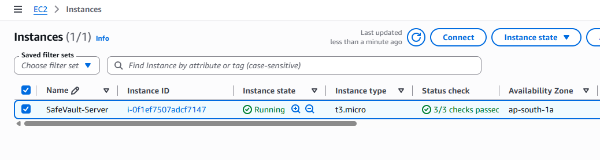
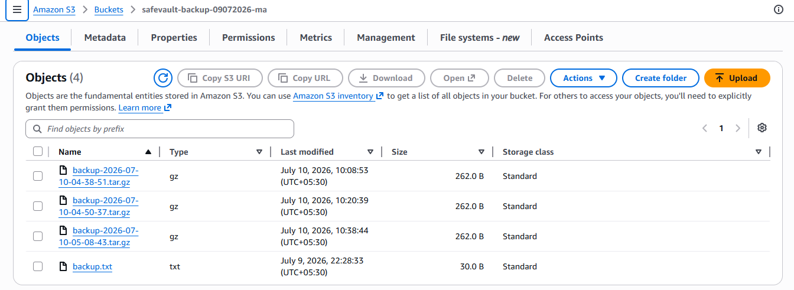
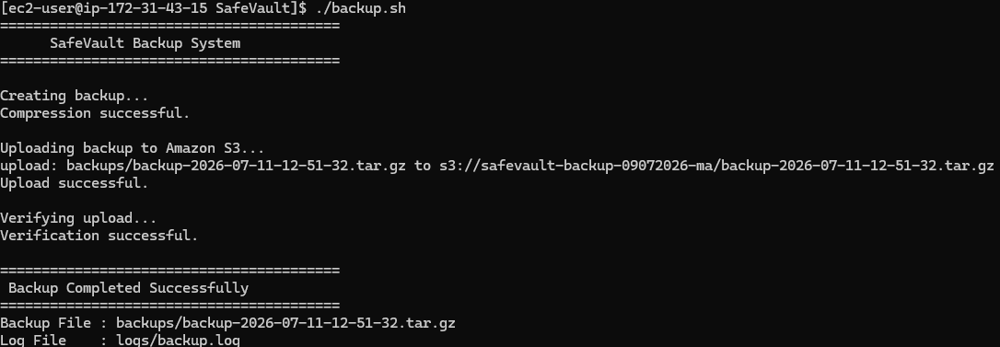
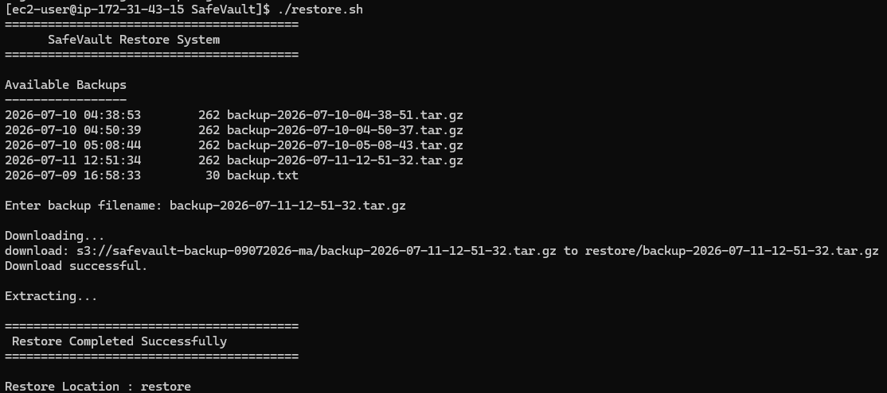
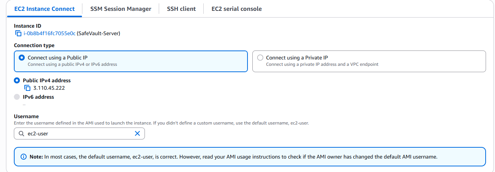

# SafeVault – AWS Disaster Recovery & Backup Automation System

<p align="center">


</p>

---

# 📌 Project Overview

SafeVault is an AWS-based Disaster Recovery and Backup Automation System developed using **Amazon EC2, Amazon S3, IAM Roles, AWS CLI, and Bash scripting**.

The project automates the process of creating compressed backups, securely storing them in Amazon S3, and restoring them whenever required.

To follow AWS security best practices, the solution authenticates using an **IAM Role** attached to the EC2 instance instead of storing AWS Access Keys.

---

# 🏗️ Solution Architecture



---

# ✨ Key Features

- Automated backup using Bash scripting
- On-demand restore from Amazon S3
- Timestamp-based backup archives
- Secure IAM Role authentication
- Configuration-driven automation
- Local logging of backup and restore operations
- Secure storage in Amazon S3
- CloudWatch Log Group prepared for future integration

---

# ☁️ AWS Services Used

| Service | Purpose |
|----------|---------|
| Amazon EC2 | Hosts the SafeVault application |
| Amazon S3 | Stores compressed backup archives |
| IAM Role | Secure authentication without access keys |
| AWS CLI | Uploads and downloads backups from S3 |
| Amazon CloudWatch | Log Group created for future monitoring |

---

# 📁 Project Structure

```text
SafeVault/
│
├── architecture/
│   └── safevault-solution-architecture.png
│
├── documentation/
│
├── screenshots/
│
├── ProjectFiles/
│   ├── config.txt
│   ├── database.txt
│   └── logs.txt
│
├── backups/
│
├── restore/
│
├── logs/
│   └── backup.log
│
├── backup.sh
├── restore.sh
├── config.conf
├── README.md
└── .gitignore
```

---

# 🔄 Backup Workflow

```text
ProjectFiles
      │
      ▼
backup.sh
      │
      ▼
Compress (.tar.gz)
      │
      ▼
AWS CLI
      │
      ▼
Amazon S3
```

### Backup Process

1. Reads the configuration from `config.conf`
2. Compresses the `ProjectFiles` directory
3. Creates a timestamp-based backup archive
4. Uploads the archive to Amazon S3
5. Records the operation in `logs/backup.log`

---

# ♻️ Restore Workflow

```text
Amazon S3
      │
      ▼
restore.sh
      │
      ▼
AWS CLI (GetObject)
      │
      ▼
Extract (.tar.gz)
      │
      ▼
restore/
```

### Restore Process

1. Lists available backup archives in Amazon S3
2. Downloads the selected backup archive
3. Extracts the archive into the `restore/` directory
4. Records the operation in the local log file

---

# ⚙️ Prerequisites

- AWS Account
- Amazon EC2 (Amazon Linux 2023)
- Amazon S3 Bucket
- IAM Role with:
  - ListBucket
  - GetObject
  - PutObject
- AWS CLI
- Bash

---

# 🚀 Installation

Clone the repository:

```bash
git clone https://github.com/m-allen-scott/safevault.git
```

Move into the project directory:

```bash
cd safevault
```

Make the scripts executable:

```bash
chmod +x backup.sh
chmod +x restore.sh
```

Run the backup:

```bash
./backup.sh
```

Run the restore:

```bash
./restore.sh
```

---

# ⚙️ Configuration

Update the `config.conf` file:

```bash
SOURCE_FOLDER="ProjectFiles"
BACKUP_FOLDER="backups"
RESTORE_FOLDER="restore"
LOG_FOLDER="logs"

BUCKET_NAME="safevault-backup-09072026-ma"

RETENTION_DAYS=30
LOG_FILE="backup.log"
```

---

# 📸 Screenshots

## Amazon EC2



---

## Amazon S3 Bucket



---

## Successful Backup



---

## Successful Restore



---

## CloudWatch Log Group

*(Prepared for future log integration)*



---

# 🚀 Future Enhancements

- CloudWatch Agent integration
- Amazon SNS notifications
- S3 Lifecycle policies
- Server-side encryption (SSE)
- Terraform deployment
- GitHub Actions CI/CD pipeline
- Docker support

---

# 👨‍💻 Author

**Allen Scott**

Cloud Engineering Portfolio Project

GitHub: https://github.com/m-allen-scott

---

# 📄 License

This project is created for learning and portfolio purposes.
